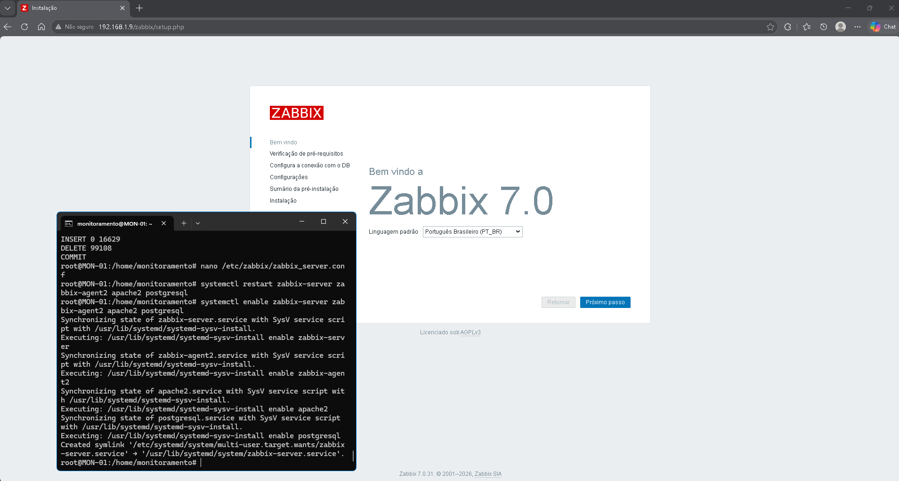
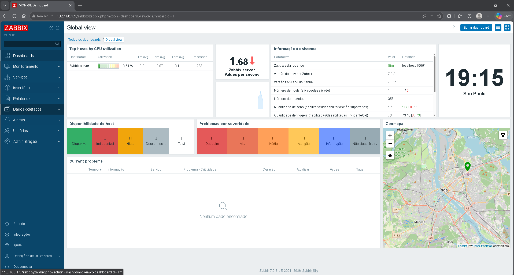
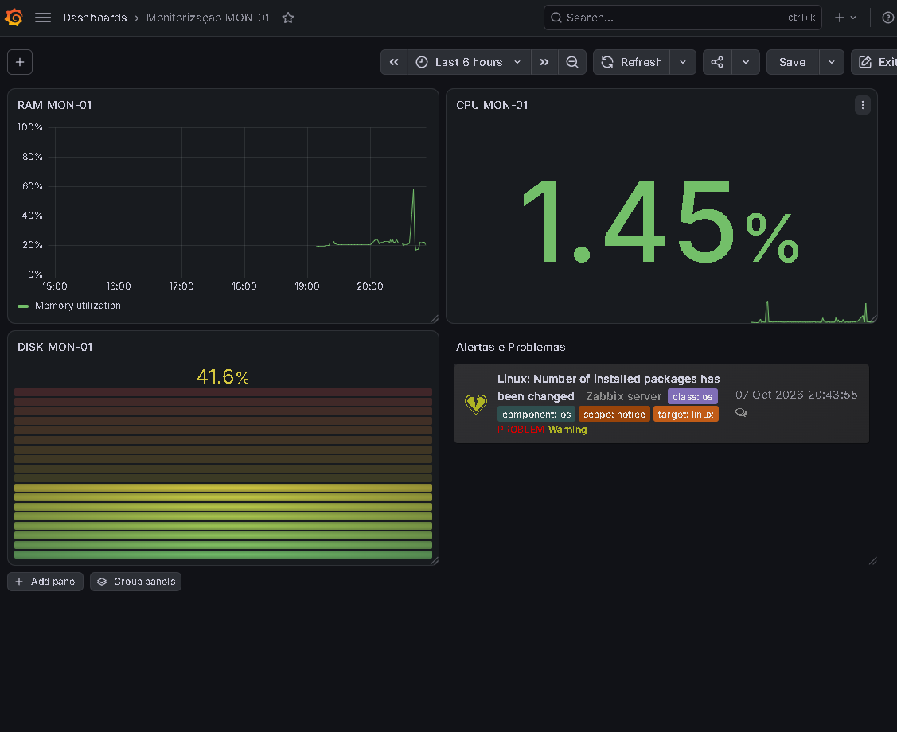

# 📊 Laboratório de Monitoramento Híbrido: Zabbix 7.0 & Grafana

Projeto prático de implantação, integração e *troubleshooting* de um ambiente de monitoramento e observabilidade de infraestrutura de TI utilizando **Zabbix 7.0** e **Grafana**, executados em máquina virtual Debian (`MON-01`).

---

## 🚀 Visão Geral da Arquitetura

O objetivo principal deste laboratório foi estruturar uma solução completa de monitoramento em tempo real para ativos de rede e servidores, permitindo a coleta de métricas de desempenho e a visualização centralizada em painéis executivos e operacionais (NOC).


```Plaintext

+-------------------------------------------------------------------+
|                            HOST WINDOWS                           |
|  +-------------------------------------------------------------+  |
|  |                 Navegador Web / Visualização                |  |
|  |             Grafana Dashboard (http://localhost:3000)       |  |
|  +------------------------------+------------------------------+  |
|                                 |                                 |
|                     Integração via Zabbix API                     |
|                                 |                                 |
|  +------------------------------v------------------------------+  |
|  |                   VM MON-01 (Debian Linux)                  |  |
|  |                                                             |  |
|  |   [ Zabbix Server 7.0 ] <---> [ PostgreSQL / Apache ]       |  |
|  |            |                                                |  |
|  |   [ Zabbix Agent ] (Coleta de métricas: CPU, RAM, Disco)   |  |
|  +-------------------------------------------------------------+  |
+-------------------------------------------------------------------+

```

---

## 🛠️ Tecnologias e Ferramentas Utilizadas

* **Sistema Operacional Guest:** Debian Linux (`MON-01`)
* **Sistema de Monitoramento:** Zabbix Server 7.0
* **Visualização & Dashboards:** Grafana Enterprise
* **Banco de Dados:** PostgreSQL
* **Servidor Web:** Apache2
* **Hypervisor:** Hyper-V / VirtualBox

---

## ⚙️ Funcionalidades e Dashboards Implementados

No Grafana, foi construído um painel customizado para o servidor `MON-01` composto por:

1. **Uso de CPU (%):** Gráfico temporal e indicador numérico em tempo real.
2. **Uso de Memória RAM (%):** Acompanhamento contínuo da consumo de memória do sistema.
3. **Ocupação de Disco (`/`):** Medidor em barra com regras de **Thresholds visuais** acopladas:
   * 🟢 **Verde:** Uso normal (< 80%)
   * 🟡 **Amarelo:** Atenção (80% a 89%)
   * 🔴 **Vermelho:** Crítico (≥ 90%)
4. **Zabbix Problems & Incidents:** Widget dedicado para listagem de alertas e *triggers* ativas, com categorização por severidade e horário de ocorrência.

---

## 🔍 Incidentes Resolvidos durante a Implantação (Troubleshooting)

Um dos maiores diferenciais deste projeto foi o diagnóstico e a solução de problemas de nível N1/N2 ocorridos no ambiente durante o processo:

### 1. Inconsistência de Autenticação na API / Banco do Zabbix
* **Sintoma:** Bloqueio de conta e falha de login do usuário `Admin` no frontend do Zabbix e na integração do Grafana.
* **Causa Raiz:** Incompatibilidade do algoritmo de hash de senha gerado nas tentativas manuais em relação ao padrão **Bcrypt** exigido pelo Zabbix 7.0.
* **Solução:** Acesso direto ao PostgreSQL via CLI, redefinição do hash da tabela `users` para um valor Bcrypt válido, limpeza de sessões antigas na tabela `sessions` e reinicialização dos serviços `zabbix-server` e `apache2`.

### 2. Instabilidade no Host (BSOD `PAGE_FAULT_IN_NONPAGED_AREA`)
* **Sintoma:** Tela azul no sistema operacional host devido ao driver de rede virtual `wsddpp.sys`.
* **Causa Raiz:** Falha de alocação de memória no kernel do Windows causada por concorrência e sobrecarga no adaptador de rede virtual acoplado à VM.
* **Solução:** Reparo da integridade de arquivos do sistema (`sfc /scannow` e `DISM`), reset completo da pilha de rede e sockets (`netsh winsock reset` / `netsh int ip reset`) e restauração segura do comutador virtual do Hyper-V.

---

## 📌 Principais Aprendizados e Competências Demonstradas

* Configuração e administração de **Zabbix 7.0** e **Grafana**.
* Integração via **Zabbix API (`api_jsonrpc.php`)** e autenticação de Data Sources no Grafana.
* Criação de regras de alerta visual (**Thresholds**) e centralização de chamados/eventos NOC.
* Resolução autonôma de problemas em infraestrutura híbrida (Linux/Windows/Redes).

## 📷 Evidências do Laboratório:

<p align="center">
  <br>
  <i>📷 Evidência 1: Ascendo via SSH o Debian no Linux para iniciar o Zabbix.</i><br>
</p>
<p align="center">
  <br>
  <i>📷 Evidência 2: Zabbix instalado.</i><br>
</p>
<p align="center">
  <br>
  <i>📷 Evidência 3: Configurados os Dashboards de monitorização do servidor MON-01</i>
</p>
<p align="center">
  <br>
  <i>📷 Evidência 4: Falha de memória no Windows devido ao driver de rede virtual no hyper-V </i>
</p>


> 📝 *Projeto desenvolvido como parte do laboratório prático de estudos em infraestrutura, redes e monitoramento de TI.*
